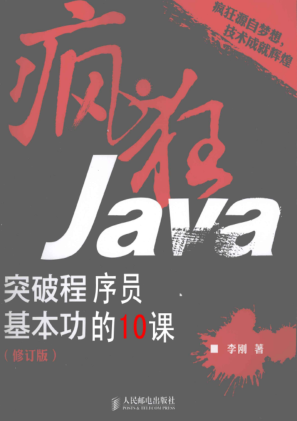

# 疯狂Java突破程序员基本功的10课

**修订版**
**作者：李刚**

---

### 目录

##### &emsp;&emsp;[第一章 数组与内存控制](./chapters/%E7%AC%AC%E4%B8%80%E7%AB%A0%20%E6%95%B0%E7%BB%84%E4%B8%8E%E5%86%85%E5%AD%98%E6%8E%A7%E5%88%B6.md)

##### &emsp;&emsp;[第二章 对象与内存控制](./chapters/%E7%AC%AC%E4%BA%8C%E7%AB%A0%20%E5%AF%B9%E8%B1%A1%E4%B8%8E%E5%86%85%E5%AD%98%E6%8E%A7%E5%88%B6.md)

[返回书单](/README.md)